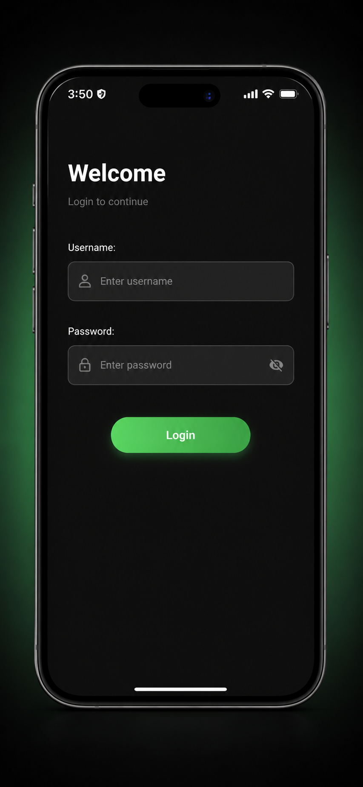
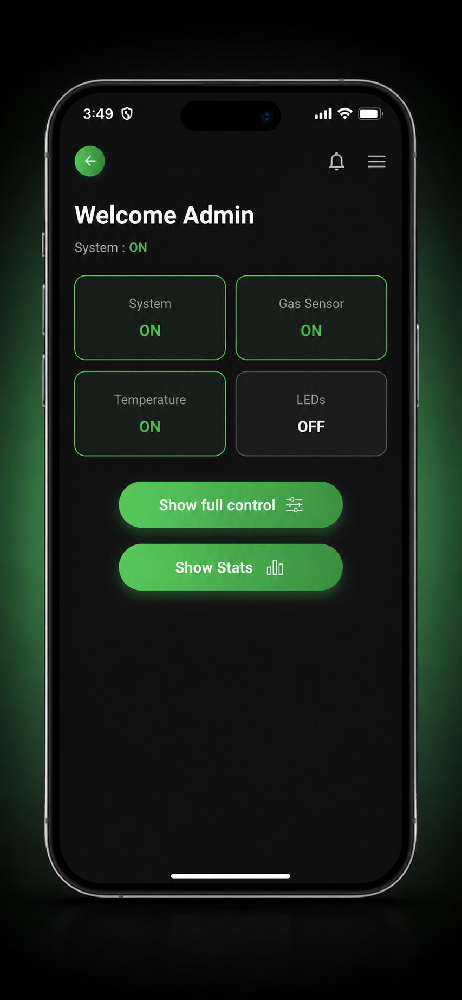
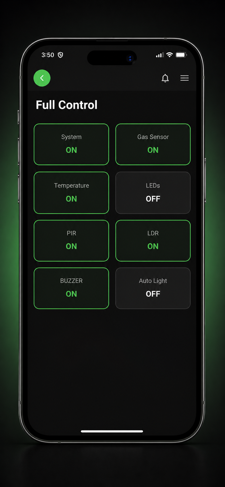
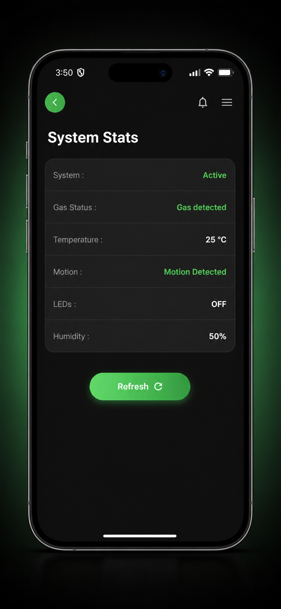
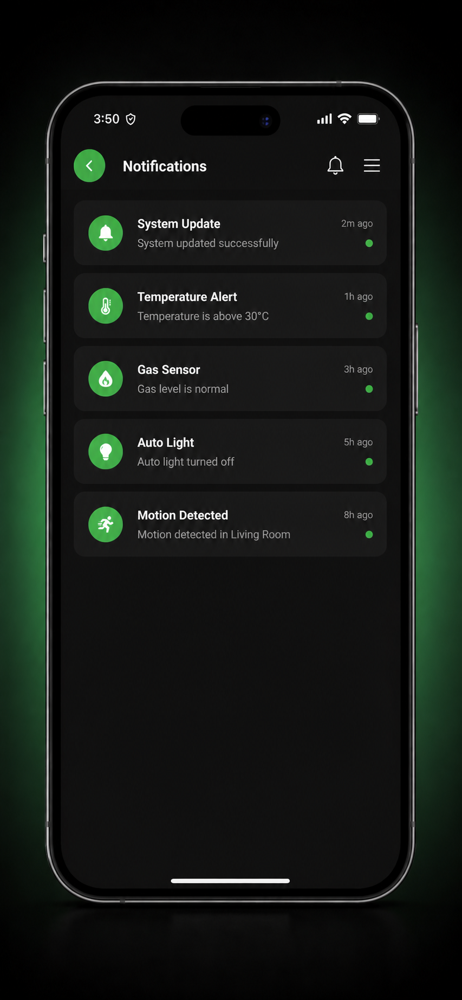
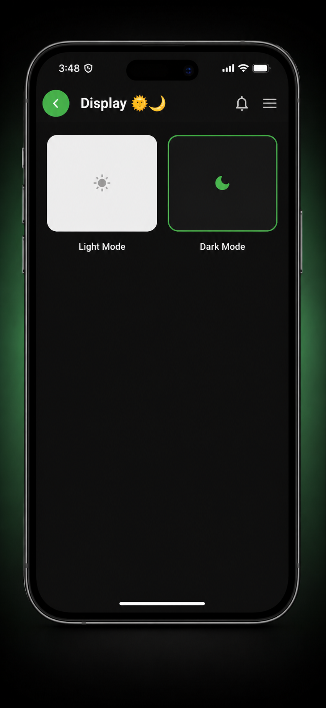

# Smart Home Control System

Smart Home Control System is a Flutter mobile application for monitoring and controlling a connected home automation setup. The app provides a modern interface for checking sensor data, managing device states, receiving safety alerts, and switching between display modes.

The project is designed for smart home and IoT use cases where users need a simple mobile dashboard to interact with sensors and actuators such as gas sensors, temperature sensors, PIR motion sensors, LEDs, buzzers, and automatic lighting.

## Overview

This application allows users to sign in, view the current system status, control connected home components, monitor environmental readings, and review important alerts from the smart home system. It is built with Flutter and can be connected to a backend service or IoT controller such as an ESP32 through HTTP endpoints.

## Features

- First-time sign up flow for creating the initial admin account
- User authentication through a login screen
- Local user storage with a development mirror in `data/users.json`
- Admin dashboard for system overview and connection status
- Smart home system status monitoring
- Full control panel for connected components
- Toggle controls for:
  - Main system
  - Gas sensor
  - Temperature sensor
  - PIR motion sensor
  - LEDs
  - Buzzer
  - Auto light mode
- System statistics screen for:
  - Temperature
  - Humidity
  - Gas detection status
  - Motion detection
  - LED status
- Notifications and alerts for:
  - System updates
  - Temperature warnings
  - Gas detection
  - Motion detection
- In-app notification history with clear action
- Persistent settings saved locally on the device
- Display settings for system, light, and dark modes
- Connection settings for saved ESP32/controller IP address
- Configurable sensor refresh interval
- Alert preferences for gas, temperature, and motion warnings
- Adjustable temperature warning threshold
- Test notification action from the settings screen
- Modern UI with a dark theme and green accent color
- IoT-ready architecture for smart device communication

## Screenshots

The following screenshots are stored in the `mobile_app/` folder.

### Login



### Dashboard



### Control Panel



### Statistics



### Notifications



### Settings



## Tech Stack

- **Flutter** - Cross-platform mobile app framework
- **Dart** - Programming language used by Flutter
- **Material Design** - UI components and visual structure
- **HTTP** - Communication with smart home backend or IoT controller
- **Flutter Local Notifications** - Local alert and notification handling
- **Permission Handler** - Runtime permission management
- **Shared Preferences** - Persistent local storage for user settings and accounts
- **State Management** - Built-in Flutter state management with `StatefulWidget` and `setState`
- **Backend / IoT Layer** - Generic REST API or ESP32-based smart home controller

## Installation

Follow these steps to run the project locally.

### 1. Clone the repository

```bash
git clone <repository-url>
cd app1
```

### 2. Install Flutter dependencies

```bash
flutter pub get
```

### 3. Connect a device or start an emulator

```bash
flutter devices
```

### 4. Run the application

```bash
flutter run
```

### 5. Build APK

Use the included Python helper to build a release APK, include the project logo, show build progress, and copy the final APK into `apk_builds/`.

```bash
python build_apk.py
```

The generated APK will be saved as:

```text
apk_builds/smart_home_self_powered.apk
```

### 6. Configure the IoT controller

On the login screen, enter the IP address of your smart home controller or backend server. The app is prepared to communicate with endpoints such as:

```text
GET  /status
POST /control
```

## Usage

1. Open the app on a mobile device or emulator.
2. On first launch, create the initial admin account from the sign-up screen.
3. After account creation, log in with the saved credentials.
4. View the dashboard to check system status and sensor availability.
5. Use the full control screen to turn sensors and devices on or off.
6. Open the statistics screen to monitor temperature, humidity, gas status, and motion state.
7. Review notifications for important alerts and safety warnings.
8. Open settings to change theme mode, controller IP, refresh interval, notification types, and temperature warning threshold.

## Project Structure

```text
lib/
+-- main.dart                      # App entry point and root configuration
+-- screens/                       # Main application screens
|   +-- loading_screen.dart        # Splash/loading screen with app logo
|   +-- signup_screen.dart         # First-time account creation screen
|   +-- login_screen.dart          # Authentication and controller IP input
|   +-- home_screen.dart           # Dashboard and system overview
|   +-- control_screen.dart        # Full smart home control panel
|   +-- stats_screen.dart          # Sensor readings and system statistics
|   +-- notifications_screen.dart  # In-app alerts and notification history
|   +-- display_screen.dart        # Theme, connection, and alert settings
|   +-- about_screen.dart          # Team, project, and university information
+-- services/                      # App services and integrations
|   +-- app_settings_service.dart  # Persistent app settings storage
|   +-- user_storage_service.dart  # Local account creation and login storage
|   +-- connection_service.dart    # HTTP communication with IoT controller
|   +-- notification_service.dart  # Local notification setup and alerts
+-- models/                        # Data models
|   +-- app_user.dart              # Local user account model
+-- widgets/                       # Reusable UI components
|   +-- control_button.dart        # Toggle-style control button
+-- assets/                        # Images and static assets

data/
+-- users.json                     # Development mirror for locally created users

android/                           # Android platform files
ios/                               # iOS platform files
web/                               # Web platform files
test/                              # Flutter widget and unit tests
pubspec.yaml                       # Project dependencies and assets
```

## Future Improvements

- Add real-time sensor updates using WebSockets or MQTT
- Integrate with Firebase, Supabase, or a custom backend
- Add push notifications for critical alerts
- Improve role-based access for admin and regular users
- Add historical charts for temperature, humidity, gas, and motion events
- Store user preferences such as theme mode and default controller IP
- Add device discovery for local IoT controllers
- Improve offline mode and connection recovery
- Add automated tests for authentication, controls, and services

## Contributing

Contributions are welcome. To contribute:

1. Fork the repository.
2. Create a new branch for your feature or fix.
3. Make your changes with clear, readable code.
4. Test the app before submitting.
5. Open a pull request with a short description of your changes.

Please keep contributions focused, documented, and consistent with the existing Flutter project structure.

## License

This project is licensed under the MIT License.

See the [LICENSE](LICENSE) file for details.
